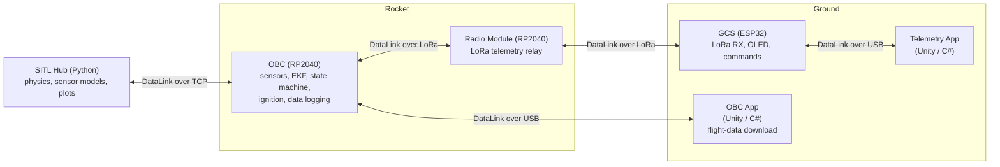
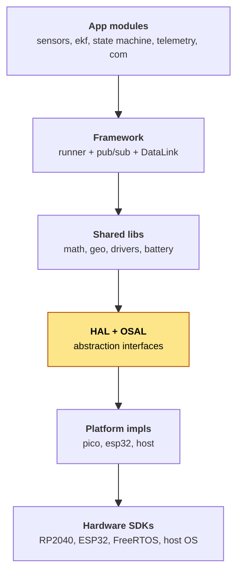
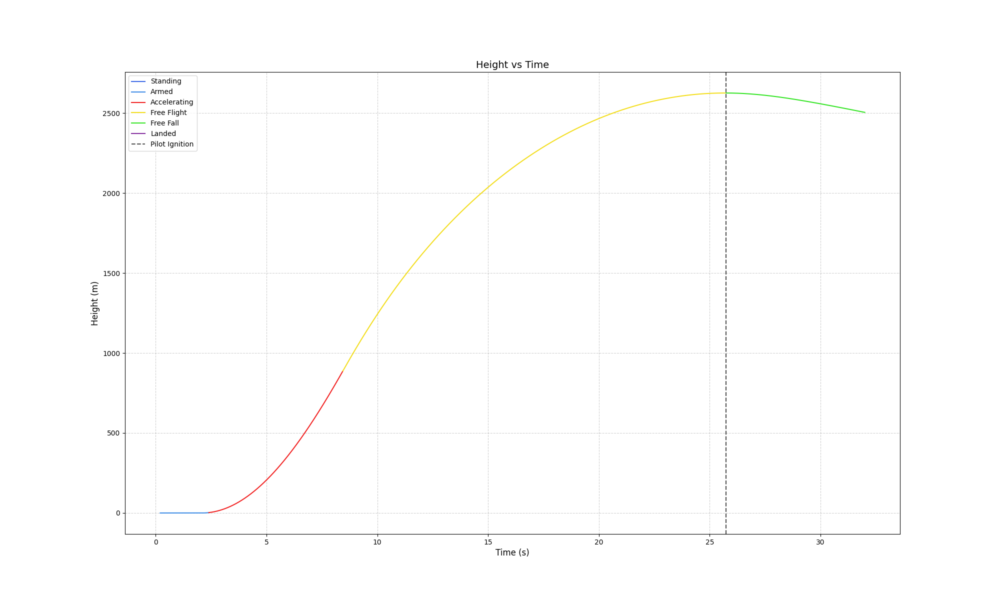
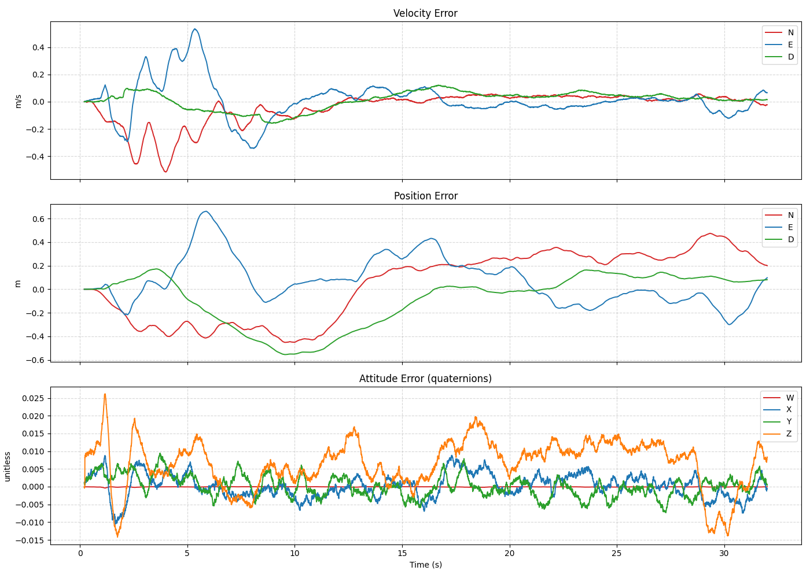
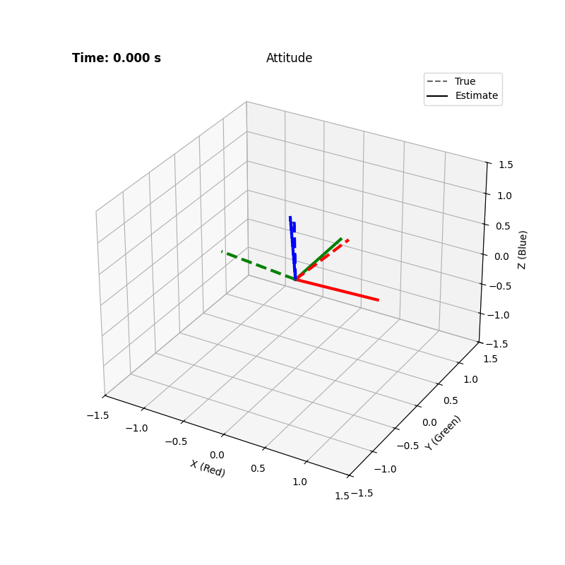
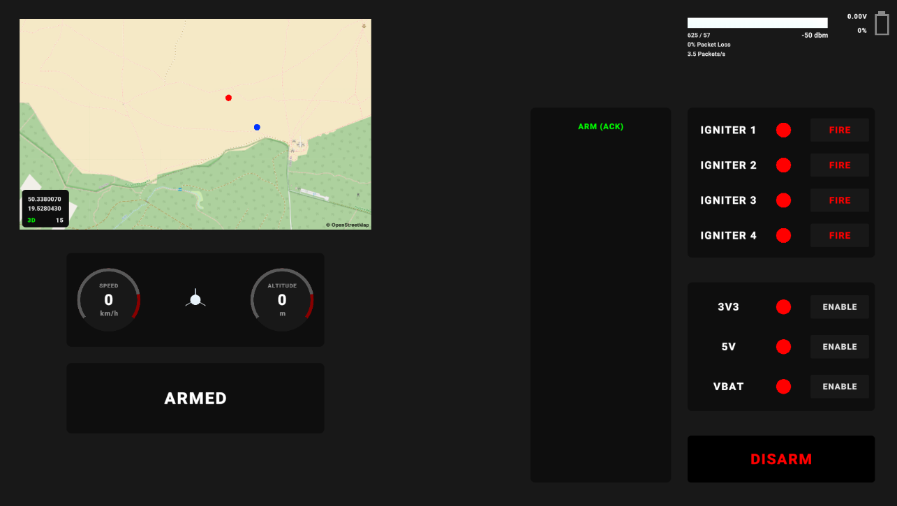
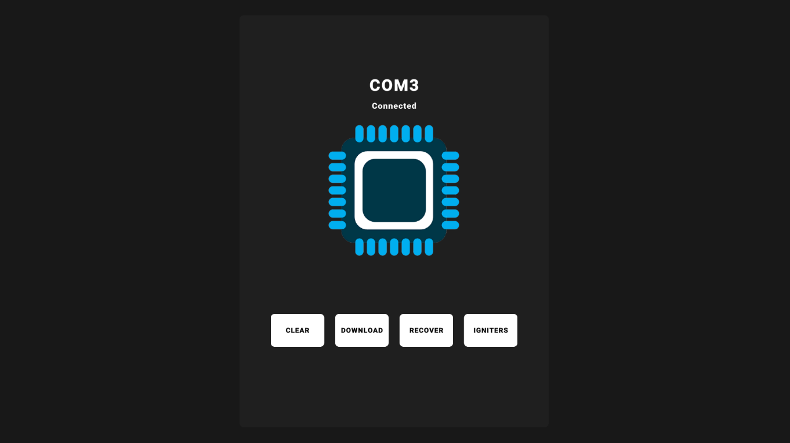

# Rocket Flight Software Stack

A complete, portable embedded software stack for a sounding rocket: flight firmware, a telemetry ground station,
a code-generated communication protocol, and a hardware-in-the-loop simulator. One portable module codebase runs
across RP2040, ESP32, and a host (SITL) target.

[](https://github.com/RocketScienceOfficial/rocket-codebase/actions/workflows/firmware-build.yml)
[](https://github.com/RocketScienceOfficial/rocket-codebase/actions/workflows/firmware-audit.yml)
[](https://github.com/RocketScienceOfficial/rocket-codebase/actions/workflows/datalink-python-tests.yml)
[](https://github.com/RocketScienceOfficial/rocket-codebase/actions/workflows/datalink-c-tests.yml)
[](https://github.com/RocketScienceOfficial/rocket-codebase/actions/workflows/datalink-csharp-tests.yml)
[](LICENSE.md)

---

## Highlights

What makes this codebase interesting from an engineering standpoint:

- **Hardware-agnostic firmware.** Application modules depend only on thin HAL and OSAL abstractions, never on a
  specific MCU or RTOS. The same modules build unchanged for RP2040 (Pico SDK), ESP32 (ESP-IDF), and a host
  target for simulation.
- **Modular, lock-free pub/sub.** Modules are fully decoupled and communicate only through a publish/subscribe
  message bus backed by a single 32 KB static pool. Concurrency uses `std::atomic` sequence numbers with
  acquire/release ordering, so there are no mutexes and no blocking publishers.
- **Zero dynamic allocation.** No `malloc`, `new`, STL containers, or exceptions anywhere in the firmware. Every
  buffer is statically sized, and a custom static-analysis pass (`make audit`) enforces this on every push in CI.
- **One protocol everywhere (DataLink).** Messages are defined once in XML schemas and code-generated to C, C#,
  and Python. Every device link, and the firmware's internal pub/sub bus, carries the same DataLink structs, so a
  single schema change propagates across firmware, apps, and the simulator. Each language target ships its own
  test suite.
- **Error-state Extended Kalman Filter.** A 22-state nominal, 21-error-state ES-EKF (quaternion attitude on
  SO(3)) fuses IMU, barometer, GPS, and magnetometer. The covariance and fusion equations are derived
  symbolically with SymPy and code-generated to C, so the math is the source of truth rather than hand-written
  matrices.
- **Pluggable hardware-in-the-loop simulation.** The unmodified flight firmware runs as a host process and
  connects to a Python hub over TCP sockets. The hub is source-agnostic, with adapters for Simulink, OpenRocket
  exports, and PX4 log replay, plus synthetic noisy-sensor scenarios.

---

## Architecture

Three firmware targets, two desktop apps, and a simulator, all speaking the same DataLink protocol:



Every link above carries DataLink message structs, and so does the firmware's internal pub/sub bus. Within the
firmware, modules never call each other directly: each implements `init()` and `run()`, is scheduled by a
JSON-defined runner into fixed-rate RTOS task pools (500 Hz, 200 Hz, 100 Hz), and exchanges data only over the
bus. Full details in [docs/main.md](docs/main.md).

### Firmware layers

The firmware is built in clean layers. Everything above the HAL and OSAL line is hardware-independent:



Module code calls only HAL and OSAL interfaces, never a platform header. That single rule is what lets the same
modules build unchanged for RP2040, ESP32, and the host (SITL) target. Selecting a target only swaps the platform
implementation directory at CMake configure time.

---

## Design rationale

A few deliberate choices shape the whole codebase:

- **No dynamic allocation.** Flight code should never fail at run time from heap fragmentation or an
  out-of-memory condition, and it must be statically analyzable. Forbidding the heap (enforced in CI by
  `make audit`) keeps memory deterministic and bounded.
- **Pub/sub over direct calls.** Decoupling modules behind a lock-free topic bus keeps the system testable and
  portable. A module is a pure function of the topics it reads and writes, no module can block another, and the
  same modules run unchanged on hardware and in SITL.
- **Schema-driven protocol.** One DataLink XML schema generates C, C#, and Python, so firmware, apps, and the
  simulator cannot drift apart. A wire-format change is a one-line edit, and a mismatch surfaces as a build or
  test failure instead of an in-flight bug.
- **Symbolically derived EKF.** Deriving the filter equations in SymPy and generating C makes the math the source
  of truth, avoids hand-written matrix mistakes, and keeps the quaternion attitude on its manifold.

For the full reasoning, see [docs/pubsub.md](docs/pubsub.md), [docs/datalink.md](docs/datalink.md), and
[docs/ekf.md](docs/ekf.md).

---

## Tech stack

| Area | Technologies |
|---|---|
| Firmware | C++20 and C (no heap, no STL, no exceptions) |
| Portability | Hardware-agnostic: modules depend only on HAL/OSAL, not on any specific MCU or RTOS |
| Targets | RP2040 (Pico SDK), ESP32 (ESP-IDF), host (SITL) |
| RTOS | Abstracted via OSAL; FreeRTOS on the MCU targets |
| Firmware architecture | Modular, lock-free pub/sub message bus; fully decoupled modules |
| Drivers and libs | RadioLib (LoRa), u8g2 (OLED) |
| State estimation | Error-state EKF, derived with Python and SymPy |
| Protocol | DataLink: XML schema to generated C, C#, and Python |
| Desktop apps | Unity 2021.3.45f2 (C#) |
| Simulation | Python (NumPy, Matplotlib); pluggable sources (Simulink, OpenRocket, PX4 logs) |
| Build and CI | CMake, Ninja, Make, GitHub Actions |

---

## Repository layout

```
rocket-codebase/
├── apps/            # Unity desktop apps (C#)
│   ├── obc_app/     #   on-board computer: flight-data download
│   ├── telemetry/   #   ground station: live telemetry display
│   └── shared/      #   shared C# / DataLink utilities
├── datalink/        # Cross-language message protocol
│   ├── schemas/     #   XML message definitions
│   ├── templates/   #   code-generation templates
│   ├── tests/       #   per-language test suites (c, csharp, python)
│   └── gen.py       #   code generator
├── docs/            # Architecture and theory documentation
├── firmware/        # Embedded firmware (all targets)
│   ├── boards/      #   per-board pin/peripheral configs
│   ├── platform/    #   HAL + OSAL per target (pico, esp32, host)
│   └── src/
│       ├── lib/     #   shared libraries (math, geo, drivers, battery)
│       ├── modules/ #   application modules (sensors, ekf, state_machine, ...)
│       └── pubsub/  #   lock-free publish/subscribe message bus
└── sim/             # Simulation
    ├── hub/         #   Python SITL orchestration hub
    └── matlab_model/#   Simulink model
```

---

## Quickstart (no hardware required)

The most interesting thing you can run without hardware is the software-in-the-loop (SITL) flight stack: the real
firmware executes on your machine while a Python hub feeds it a simulated flight.

```bash
# 1. Clone with submodules (FreeRTOS, Pico SDK, RadioLib, u8g2)
git clone --recursive https://github.com/RocketScienceOfficial/rocket-codebase
cd rocket-codebase

# 2. Build the OBC flight firmware for the host target (SITL)
cd firmware
make obc_sitl

# 3. Run the firmware SITL process (terminal A)
make obc_sitl_run

# 4. In a second terminal, install and run the simulation hub (terminal B)
cd sim/hub
pip install -e .
make run CONFIG=or_taipan
```

> Requires Python 3.10+, CMake, Ninja, and a host C/C++ compiler. For the full toolchain (ARM GNU for the Pico
> targets, ESP-IDF for the GCS, Unity for the apps) and on-hardware flashing, see [docs/main.md](docs/main.md).

---

## Simulation and SITL

`sim/hub/` is a Python hub that connects firmware SITL processes over sockets, runs the physics and sensor
models, and plots the results. Because the exact same firmware runs in SITL as on the flight computer, the
simulator doubles as a regression harness for the estimation and flight logic.

The hub is deliberately pluggable. Flight sources sit behind a common interface, with existing adapters for
**Simulink** models, **OpenRocket** exports, and **PX4** log replay, alongside fully synthetic scenarios. Adding
a new source means writing one adapter.

The `or_taipan` config drives the firmware with an OpenRocket-simulated flight: the hub integrates the trajectory
and synthesizes noisy IMU, barometer, GPS, and magnetometer measurements, then compares the firmware's on-board
EKF estimate against ground truth.

<p align="center">
  
  
</p>

The animation below is a PX4 log replay. The EKF is initialized with a deliberately wrong attitude and converges
to the true orientation as measurements arrive:

<p align="center">
  
</p>

---

## Applications

Two Unity desktop apps share DataLink C# utilities with the firmware protocol:

| Telemetry ground station | OBC data-download app |
|---|---|
|  |  |
| Live telemetry display for the ground station | Downloads logged flight data from on-board flash |

---

## Testing

```bash
cd firmware
make test       # build and run the firmware unit tests (ctest)
make audit      # static check for heap, STL, and exception usage

python datalink/run_tests.py   # protocol test suites across C, C#, and Python
```

---

## Documentation

- [docs/main.md](docs/main.md): setup, toolchains, build commands, and the full firmware, protocol, and app
  architecture.
- [docs/ekf.md](docs/ekf.md): the error-state Kalman filter theory write-up, covering state representation, error
  injection, prediction, and measurement updates.
- [docs/datalink.md](docs/datalink.md): the DataLink protocol and code generator, including schema format, wire
  framing, and cross-language layout.
- [docs/pubsub.md](docs/pubsub.md): the lock-free publish/subscribe message bus, ring buffers, the RPC layer, and
  scheduler integration.

---

## Contributing

This is an actively developed project. Bug reports and pull requests are welcome. For larger changes, please open
an issue first to discuss the approach. For licensing or access questions, contact the maintainer.

---

## Acknowledgements

Built on these open-source projects: [FreeRTOS](https://www.freertos.org/), the
[Raspberry Pi Pico SDK](https://github.com/raspberrypi/pico-sdk),
[ESP-IDF](https://github.com/espressif/esp-idf), [RadioLib](https://github.com/jgromes/RadioLib), and
[u8g2](https://github.com/olikraus/u8g2).

---

## License

Copyright (c) 2026 Filip Gawlik. All rights reserved.

This is a proprietary, source-available project. The source is published for review and evaluation; use,
redistribution, and derivative works require the owner's written permission. See [LICENSE.md](LICENSE.md) for the
full terms.
