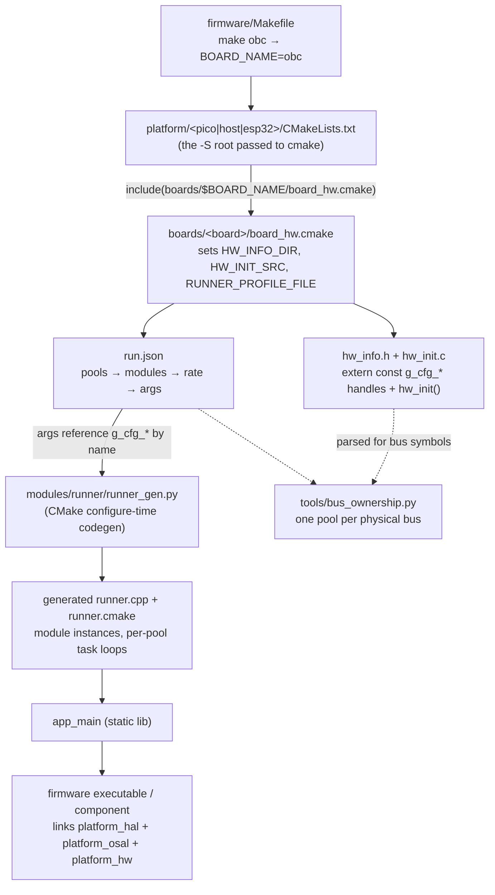

# HAL / Board Wiring

> How a single module codebase ends up running on three different chips. Covers the HAL/OSAL
> interface, the per-board contract (`board_hw.cmake`, `hw_info.h`, `hw_init.c`, `run.json`), how
> `run.json` becomes generated C++, and the static bus-ownership audit that keeps it safe.

---

## 1. Motivation

The firmware runs on three physically different targets — RP2040 (OBC, Radio Module) and ESP32
(GCS) — plus a host build of each for SITL (see [main.md](main.md)). Module code
(`firmware/src/modules/`) is the same source in all cases: it never includes a platform header and
never sees a literal pin number. Two things make that possible:

- A **HAL/OSAL interface** (`firmware/platform/include/`) that every module compiles against,
  implemented once per platform.
- A **board layer** (`firmware/boards/<name>/`) that supplies the concrete pin/bus numbers and
  decides which modules run, at what rate, wired to which handles — without either the module or
  the HAL implementation knowing about the other.

This doc is about that second part: the board contract, and the build-time machinery that turns
it into a running set of RTOS tasks.

---

## 2. The four layers

```
Module            firmware/src/modules/<name>/       — HAL/OSAL calls only, no platform headers
      ▲ constructor args (hal_*_bus_t / hal_gpio_pin_t handles)
Board             firmware/boards/<name>/             — concrete pin/bus numbers + task profile
      ▲ implements
HAL/OSAL          firmware/platform/include/          — platform-agnostic C interface (headers only)
      ▲ implements
Platform          firmware/platform/{pico,esp32,host}/ — driver .c files for one chip/SDK
```

A module is handed opaque handles (a bus index, a pin number) through its constructor; it calls
`hal_spi_transfer(bus, ...)` and has no idea whether that bus is RP2040 hardware SPI, an ESP-IDF
SPI peripheral, or a host no-op. The board layer is what decides *which* physical bus that handle
refers to, and the platform layer is what makes the handle do something.

Build-time, the chain from `make` to a linked binary looks like this:



---

## 3. The board contract

Every board directory (`firmware/boards/<name>/`) provides exactly four things:

### `board_hw.cmake`

Included by the platform's root `CMakeLists.txt` before anything else, via
`include(../../boards/${BOARD_NAME}/board_hw.cmake)`. It must set three CMake variables:

| Variable | Meaning |
|---|---|
| `HW_INFO_DIR` | Directory containing `include/hw_info.h`, exposed to the whole build via the `platform_hw` interface library |
| `HW_INIT_SRC` | Path to `src/hw_init.c`, compiled into the firmware/component target |
| `RUNNER_PROFILE_FILE` | Path to `run.json`, consumed by `runner_gen.py` |

It can also add plain board-specific compile definitions, and for the ESP32 board, point at
ESP-IDF's `sdkconfig`/`sdkconfig.defaults`/`partitions.csv`.

**`BOARD_FLASH_SIZE` is the one to know about** — every board except `gcs` defines it (check a given
board's `board_hw.cmake` for its current value), and it feeds three unrelated consumers that have
nothing to do with each other except sharing this one macro name:

- **`pico` platform:** `platform/pico/board/pico_custom_board.h` (the custom Pico-SDK board
  header selected via `PICO_BOARD_HEADER_DIRS`/`PICO_BOARD` in `platform/pico/CMakeLists.txt`)
  defines `PICO_FLASH_SIZE_BYTES` as `BOARD_FLASH_SIZE` — this is what the SDK's boot2 stage and
  linker script use for the chip's actual physical flash size.
- **`host` platform:** `platform/host/hal/flash_driver_host.c` sizes its emulated flash as
  `static uint8_t g_flashMemory[BOARD_FLASH_SIZE]` and reads/writes a same-sized `flash.bin`
  backing file.
- **The `database` module:** `src/modules/database/DatabaseFlashConfig.h` computes
  `SECTORS_COUNT_DATA` as "whatever sectors remain after the reserved program/metadata/standing-buffer
  region" using `BOARD_FLASH_SIZE`, and `static_assert`s that the reserved region actually fits
  within it.

The reason `gcs` is the odd one out: ESP32's `flash_driver_esp32.c` uses ESP-IDF's own
partition-table APIs (`partitions.csv`/`sdkconfig`, mentioned above) instead of this macro, and the
`database` module isn't in GCS's `run.json` module list. But note that
`gcs_sitl` *does* define `BOARD_FLASH_SIZE` even though `database` isn't in its module list
either — because the `host` platform's `platform_hal` library unconditionally compiles
`flash_driver_host.c` for every host board, regardless of whether that board's modules use flash.
The same is true for `pico`: `radio_module` defines `BOARD_FLASH_SIZE` even though it never uses
`database`, purely because `platform/pico/CMakeLists.txt` unconditionally compiles
`hal/flash_driver_pico.c` and sets up `pico_custom_board.h` for every Pico board. In short: **which
platform you're on decides whether `BOARD_FLASH_SIZE` is required, not whether your board's module
list actually touches flash.**

### `include/hw_info.h`

Declares every pin and bus the board uses as an `extern const` global, using the `g_cfg_*` naming
convention, plus the `hw_init()` prototype:

```c
// --- BUSES ---
extern const hal_spi_bus_t g_cfg_spi;
extern const hal_uart_bus_t g_cfg_uart;

// --- PINS ---
extern const hal_gpio_pin_t g_cfg_cs_bmi_acc_pin;
// ...

void hw_init(void);
```

This header is the *only* thing shared between the board layer and everything downstream: modules
never include it directly (they receive handles as constructor args, resolved by
[runner_gen.py](#4-from-runjson-to-a-running-task)), but `run.json` args and the bus-ownership
audit both read it by name.

### `src/hw_init.c`

Defines the globals declared above with the board's actual pin/bus numbers, and implements
`hw_init()` — normally `hal_stdio_init()` + one `hal_<bus>_init_bus()` call per declared bus +
`hal_time_init()` (and `hal_flash_init()` where the module list needs flash, e.g. OBC's
`database` module). This runs once, before any RTOS task starts (see `core_main()` in
[§4](#4-from-runjson-to-a-running-task)).

### `run.json`

An array of **pools** (RTOS work queues). Each pool becomes one RTOS task and lists the modules
that run inside it:

```json
{
    "name": "wq_spi",
    "priority": "high",
    "modules": [
        { "name": "sensors_bmi088", "stack_size": 1024, "rate": 500, "args": ["g_cfg_spi", "g_cfg_cs_bmi_acc_pin", "g_cfg_cs_bmi_gyro_pin"] }
    ]
}
```

- `priority` is `"high"` / `"normal"` / `"low"`, mapped to `OSAL_TASK_PRIORITY_*`.
- `stack_size` (bytes) must be **at least 1024 and a power of two** — `runner_gen.py` enforces both
  at CMake configure time and aborts naming the offending module otherwise.
- `args` are spliced **verbatim** into the module's constructor call — a `g_cfg_*` symbol
  (resolved via `hw_info.h`), a `CFG_*` macro (from `hw_info.h` itself or a header it pulls in,
  e.g. `boards/shared/lora_config.h`), or a literal (`"0"`, `"true"`). The generator does no type
  checking here — a bad name only surfaces as a C++ compile error inside the *generated*
  `runner.cpp`.
- A pool is either fully rated (every module has a `"rate"`, in Hz) or a single rateless module
  (no `"rate"` at all) — `runner_gen.py` rejects anything mixed. Rateless pools are for modules
  that block on their own (e.g. a blocking socket `recv` in a SITL bridge module) rather than
  being polled on a timer.

Pool names are **not** the fixed `fast`/`com`/`slow` triad — each board defines its own pools,
usually named after the resource they own (`wq_spi`, `wq_i2c`, `wq_lora`, `wq_commander`, ...).
See [§6](#6-board-inventory) for what each board actually declares.

---

## 4. From `run.json` to a running task

`modules/runner/CMakeLists.txt` runs `runner_gen.py --profile <RUNNER_PROFILE_FILE>` at CMake
configure time, regenerating `build/<board>/src/modules/runner/generated/{runner.cpp,runner.cmake}`
whenever `run.json` or the generator script itself is newer than the last run (tracked with a
`.stamp` file). Before generating anything it calls `bus_ownership.check_board` on the profile
(see [§5](#5-bus-ownership-audit)) and aborts the CMake configure if that fails.

For each module referenced anywhere in the profile, the generator locates its class by convention:
the module's directory must contain exactly one `*Module.h`/`*Module.hpp` file, and the class name
is that file's stem (e.g. `sensors_bmi088/bmi088_Module.h` → class `bmi088_Module`). It then
generates, per pool:

- One static instance per module, constructed with its `args` list pasted in as-is.
- A task function that, for a rated pool, computes each module's next-due time from its `rate` and
  runs a tight loop picking the soonest-due module, sleeping via `osal_task_delay_until` in
  between — so a 500 Hz module and a 100 Hz module can share one task without either starving the
  other. Rateless pools just call every module's `run()` back-to-back in a `while
  (osal_task_should_run())` loop.
- A `spawnTask` call per pool at the configured priority, each task's stack carved out of one
  global static byte array sized as `Σ over pools of round_up_pow2(max module stack_size in that
  pool)` — consistent with the repo's no-heap-allocation constraint.

`runner.cmake` (also generated) adds `add_subdirectory` for every referenced module and links its
`app_modules_<name>` library into `app_main`. `core_main()` — called from each platform's `main.cpp`
— is just `hw_init(); start_tasks();`.

---

## 5. Bus ownership audit

`firmware/tools/bus_ownership.py` enforces one rule: **a physical bus must be driven from a single
RTOS task.** It parses `hw_info.h` for `extern const hal_*_bus_t g_cfg_*;` declarations, then scans
`run.json` for any module `args` entry matching one of those symbol names. If the same bus symbol
appears in the `args` of modules belonging to more than one pool, it's a violation — two tasks
would be issuing transfers on the same bus with no locking (the pub/sub bus is lock-free by relying
on single-producer topics; the HAL layer has no locking at all).

This runs in two places:

- **At CMake configure time**, inside `runner_gen.py`, for the board currently being built —
  blocks the build.
- **In `firmware/tools/audit.py`**, across *every* board directory regardless of
  what's currently being built — this is what CI's `firmware-audit.yml` runs.

Boards with no declared bus symbols (all the `_sitl` boards on `host`, since the host HAL has no
real buses) are skipped — nothing to own.

---

## 6. Board inventory

| Board | Platform | Chip | Buses | Wiring pattern (see the board's `hw_info.h`/`run.json` for exact pins and modules) |
|---|---|---|---|---|
| `obc` | `pico` | RP2040 | SPI, UART | Flight sensor stack (IMU, mag, baro, GPS, external ADC) shares one SPI bus, each device on its own CS pin; igniter enable/detect channels on GPIO/ADC |
| `obc_sitl` | `host` | — | none | `sim_bridge` (rateless, TCP) replaces the whole sensor stack, publishing physics-derived sensor topics directly; estimation/control modules run against those topics unmodified |
| `radio_module` | `pico` | RP2040 | SPI, UART | LoRa radio on SPI with separate TX/RX enable pins (RF front-end switch) |
| `radio_module_sitl` | `host` | — | none | `sim_uart` / `sim_lora` (rated, TCP) replace the physical UART/LoRa comm modules |
| `gcs` | `esp32` | ESP32 | SPI, I2C, UART | LoRa radio on SPI; display + power-management peripherals share an I2C bus; ESP-IDF `sdkconfig`/`partitions.csv` controls flash layout and RTOS config |
| `gcs_sitl` | `host` | — | none | Peripheral-driver modules (display, power mgmt, GPS parser) keep running as real modules against dummy `"0"` handles (the host HAL's bus functions are no-ops); only the comm modules are swapped for `sim_*` TCP bridges |

`boards/shared/` holds config that's identical across boards regardless of pool wiring:
`lora_config.h` (frequency/bandwidth/SF/power, shared node IDs) and `sim_config.h` (the TCP
host/port each SITL bridge module connects to on `sim/hub`).

Note the platform/host asymmetry in how HAL sources get compiled: on `pico` and `esp32`,
`hal/*_driver_<platform>.c` are listed directly in the executable/IDF-component target, and
`platform_hal` is a header-only `INTERFACE` library. On `host`, `platform_hal` is a real `STATIC`
library that compiles those sources itself (and links `HW_INIT_SRC` into itself rather than into
the final executable). Functionally equivalent, but worth knowing when tracing a link error.

---

## 7. Adding a new board

1. Create `firmware/boards/<name>/` with `board_hw.cmake`, `include/hw_info.h`, `src/hw_init.c`,
   `run.json` (a `_sitl` board only needs `hw_info.h`/`hw_init.c` to call `hal_stdio_init()` +
   `hal_time_init()`, since there's no real hardware to bring up). If the board targets `pico` or
   `host`, `board_hw.cmake` must also define `BOARD_FLASH_SIZE` (see [§3](#board_hwcmake)) even if
   the board never uses the `database` module — both platforms compile a flash driver that needs
   it unconditionally. `gcs`-style ESP32 boards don't need it.
2. There is no central board registry — a board becomes buildable simply by passing
   `-D BOARD_NAME=<name>` to the matching platform's CMake root (`platform/pico`, `platform/host`,
   or `platform/esp32`). `firmware/Makefile` targets are just fixed `(platform, BOARD_NAME)` pairs,
   so a genuinely new board also needs a new Makefile target (or invoke `cmake`/`idf.py` directly).
3. List every module the board runs in `run.json`, grouped into pools by which bus they touch —
   run `python tools/audit.py` (or just build; `runner_gen.py` checks the same thing at configure time) to
   catch a bus shared across pools before it becomes a runtime race.
4. Build it. A typo'd `g_cfg_*` name in `run.json` surfaces as an "undeclared identifier" in the
   generated `runner.cpp`, not as a nicer error from the generator itself.

## 8. Adding a new platform

1. Create `firmware/platform/<name>/` with its own root `CMakeLists.txt` (the path passed to
   `cmake -S`). Near the top: `include(../../boards/${BOARD_NAME}/board_hw.cmake)`.
2. Implement every HAL header in `firmware/platform/include/hal/include/hal/` (currently `gpio`,
   `uart`, `i2c`, `spi`, `adc`, `pwm`, `time`, `flash`, `stdio`, `waveform` — check the directory for
   the current set) as `hal/<driver>_driver_<platform>.c`, plus both OSAL headers in
   `firmware/platform/include/osal/include/osal/` (`task.h`, `systime.h`) backed by whatever
   RTOS/threading primitive the target provides.
3. Define the three interface libraries other CMakeLists.txt files expect to exist:
   `platform_hw` (exposes `HW_INFO_DIR`), `platform_hal` (HAL headers + driver sources),
   `platform_osal` (OSAL headers + implementation).
4. `add_subdirectory(../../src ...)` to pull in `app_main`, then define the final
   executable/component and link `app_main` + the three `platform_*` libraries + `${HW_INIT_SRC}`.
5. Give `main()` (or the platform's equivalent entry point) a single call to `core_main()` — see
   `platform/{pico,host,esp32}/main.cpp` for the three existing one-liners.

---

See [main.md](main.md) for the wider firmware architecture, [pubsub.md](pubsub.md) for how modules
talk to each other once running, and `firmware/tools/audit.py` /
`firmware/tools/bus_ownership.py` for the enforcement code referenced above.
